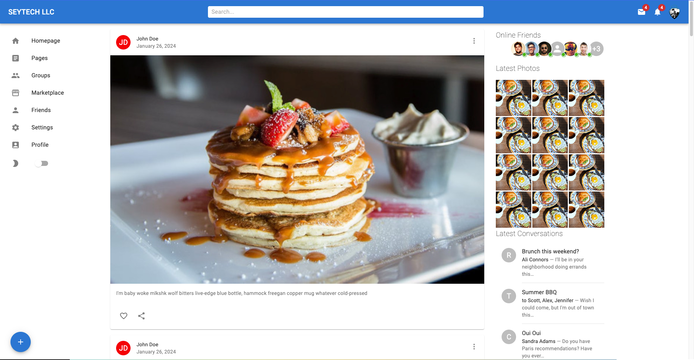
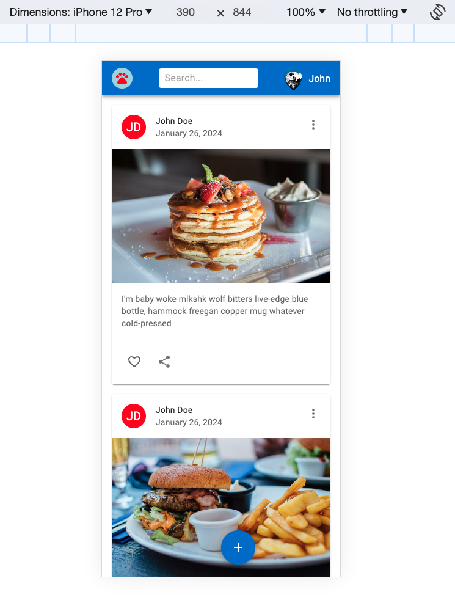

### React Material UI App

This React project is implemented using Material UI (https://mui.com/material-ui/)

- Full screen view
  

- Responsive view
  

### Material UI Installation

Install Material UI, the world's most popular React UI framework.

`$ npm install @mui/material @emotion/react @emotion/styled`

### Roboto font

Material UI uses the Roboto font by default. Add it to your project via Fontsource, or with the Google Fonts CDN.

To install Roboto through the Google Web Fonts CDN, add the following code inside your project's tag:

```
<link rel="preconnect" href="https://fonts.googleapis.com" />
<link rel="preconnect" href="https://fonts.gstatic.com" crossorigin />
<link
  rel="stylesheet"
  href="https://fonts.googleapis.com/css2?family=Roboto:wght@300;400;500;600;700&display=swap"
/>

```

### Install Material icons

`$ npm install @mui/icons-material`

### Usage

Refer to official docs for the usage: https://mui.com/material-ui/getting-started/usage/
