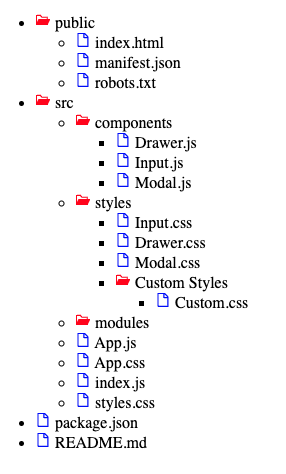

### Options to use data in this project:

- 1. Use local data from data.js file
- 2. Fetch data from an API endpoint: https://65b42574770d43aba47af813.mockapi.io/api/v1/data

### Install `react-icons` for this project

- React Icons: https://react-icons.github.io/react-icons/

### UI View

