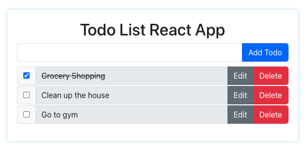

### React Todo List App

- You need to install `reactstrap` and `bootstrap` for this project, and add this `import "bootstrap/dist/css/bootstrap.min.css"` to your index.js file
- - https://reactstrap.github.io/?path=/story/home-installation--page

- Here's the sample output in the UI:
  
